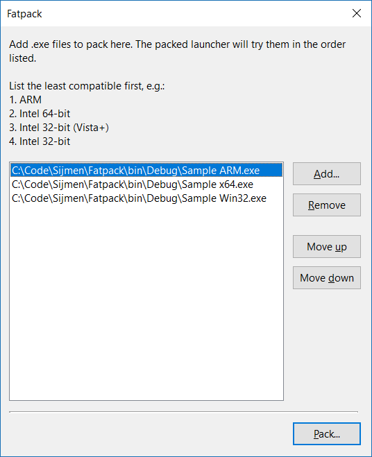

# Fatpack

Build multi-architecture 'fat' binaries for Windows.

## What does it do

_Fatpack_ combines Windows programs for multiple architectures or Windows
versions into a single executable that runs on:

 - 32-bit Intel (XP and up)
 - 64-bit Intel (XP and up)
 - 64-bit ARM (10 and up)

To see it in action, download Fatpack from the releases page. It is a fat
binary for 32-bit Intel, 64-bit Intel, and ARM (untested).

## Why

As an experiment, although it may turn out useful. Having a fat binary beats
making non-technical users pick the most appropriate version for their
computer, or having to distribute multiple different versions in the first
place.

## How does it work

_Fatback_ embeds the executables as resources in a 32-bit Intel loader stub.
32-bit Intel binaries are supported on 64-bit Intel through Windows on Windows
64, and on 64-bit ARM through emulation.

When launched, the loader tries each embedded executable in sequence until one
works. Careful ordering of the packed executables assures that the most
appropriate verion is run (see _Packing order_ below).

The Fatpack packer tool itself embeds an empty version of the loader. When
packing, it extracts it and uses _UpdateResource_ to embed the executables.

## How to use

 1. Download a release from the _Releases_ page on GitHub, or download the
    and compile the source.
 2. Launch _Flatpack_.
 3. Click the _Add_ button to add your binaries. Then use _Move up_ and
    _Move down_ to put them in the best order (see _Packing order_ below)
 4. Click _Pack_, name the fat binary, and click _Save_.

## Packing order

Fatpack's loader stub does not inspect and compare the current system
architecture with the target architecture embedded binaries. This has a few
reasons:

 - Simplicity of implementation.
 - Forward compatibility. For example, in the future Windows could shield
   emulated software from the architecture of the host sytem.
 - Flexibility of use. E.g. this method also allows for executables targeting
   different Windows versions to be combined (which the launcher stub wouldn't
   know to check).

For good results, put the least compatible binaries first. Some rules of
thumb:

 1. ARM before Intel (32-bit Intel binaries would launch emulated on ARM).
 2. 32-bit before 64-bit.
 3. Executables requiring more recent Windows versions before those requiring
    older Windows versions (e.g. Windows 10-only before XP+).

## Example

If you have four versions of your program: a legacy 32-bit Intel version for
Windows XP and up, 32-bit and 64-bit Intel versions for Windows 7 and up, and
an ARM 64-bit version for Windows 10 and up, use the following order:

 1. ARM 64-bit
 2. Intel 64-bit (Windows 10 and up)
 3. Intel 32-bit (Windows 10 and up)
 4. Intel 32-bit (Windows XP and up)

On Windows on ARM, the launcer tries the first entry and succeeds, launching
the correct ARM version. Had the 32-bit Intel version been tried before the
ARM version, it would have launched in emulation (at a performance cost).

On Windows 7 on 64-bit Intel, the launcher fails to run the ARM and Windows 10
versions of the program, and launch the 32-bit XP version.

On Windows 10 on 64-bit Intel, the launcher fails to run the ARM version but
then succeed running the 64-bit Intel version. Had the 32-bit Intel version
come before, it would have been used instead (which would be suboptimal).

## Caveats

This is all a proof of concept. Use at your own risks. Some specific caveats:

 - Local DLL dependencies are problematic because DLLs support only one
   architecture but may be referenced by many in the packed binary.
 - The embedded binaries are extracted and run from a temporary directory
   which may confuse the program as wel as overeager virus scanners.
 - Future Windows editions may not support 32-bit Intel binaries at all,
   like Windows RT did, breaking this approach.

## Future work

Some ideas:

 - Have Fatpack copy version information from one of the embedded binaries
   into the packed binary so it correctly reflects the product name, version,
   auther, and so on.
 - Embed DOS versions in the DOS loader stub.
 - Embed appx (UWP) packages for Windows 10.

## Author, bugs, etc

By Sijmen J. Mulder (<ik@sjmulder.nl>).

Use the _Issues_ tab on GitHub to report bugs or feel free to email me
directly.

Fatpack is licensed under the 2-clause "Simplified" BSD license. See
LICENSE.md.
